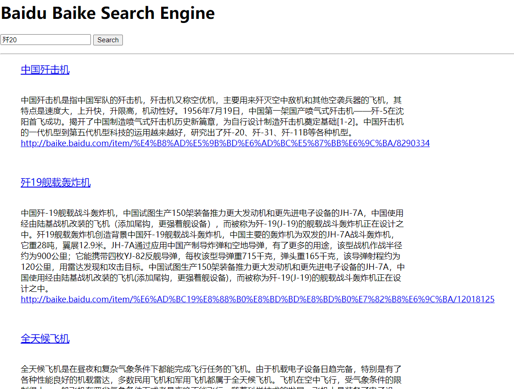
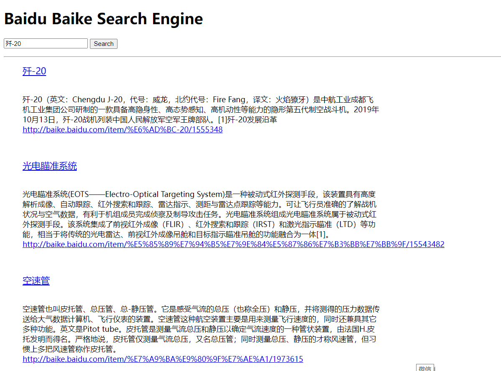

# 小灰灰百科信息检索系统 

 

## 1.系统设计

### 1.1 爬虫和网页文档解析

项目位置 [project/src/Web_Crawler](project/src/Web_Crawler)

1. 为了实现断点续爬, 在基于磁盘文件的队列(利用堆文件+首尾指针)上实现了广度优先搜索(BFS)

2. 构建了布隆过滤器排除那些可能已经被爬取过的网页

3. 将百科网页分为索引页面和百科内容页面: 

   * 对于索引页面, 将页面中的URL加入爬虫队列中, 并可以解析带瀑布流元素的索引页面

   * 对于百科内容页面, 不解析网页中的URL, 广度优先搜索到此页终止
    
4. 网页文档解析器利用 KMP算法 和 AC自动机, 实现了对网页文本中内容 tag 的查找

### 1.2 倒排索引建造器

项目位置 [project/src/Inverted_Index](project/src/Inverted_Index)

1. 在未使用数据库的情况下, 设计了倒排索引文件的底层存储结构(堆文件 + hash索引)

2. 倒排索引建造器 利用 Spark 排序 / 基于外存的多路归并排序 对爬取的原始网页文档中的 <单词,文档id>对 按照单词排序, 最后生成倒排索引

### 1.3 倒排列表的搜索与排序 (/Project/Search_Engine)

项目位置 [project/src/Search_Engine](project/src/Search_Engine)

1. 对用户在 web 界面输入的查询进行分词后, 在倒排索引中检索并返回包含查询词的文档

2. 使用 TF-IDF / BM25 计算文档的得分, 并根据文档得分对文档集合进行排序, 最后在 web 界面上呈现给用户

## 2.效果展示

 

 

## Note

详细设计文档见笔记

https://www.yinxiang.com/everhub/note/62819b63-9dc2-46a8-8ea4-ba84f638664b
 

